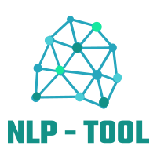
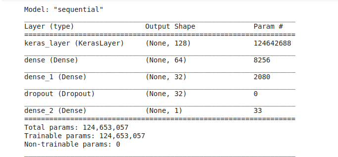
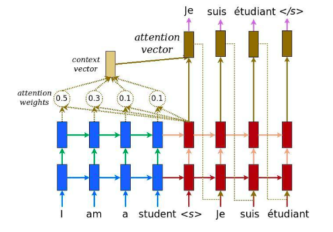
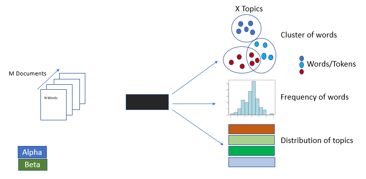
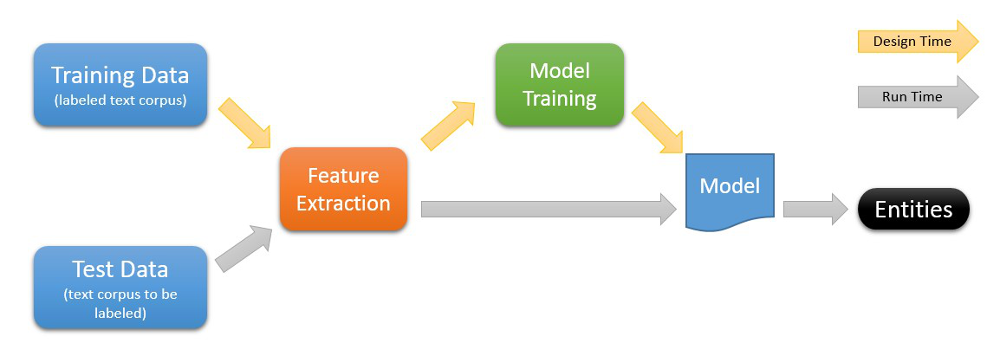
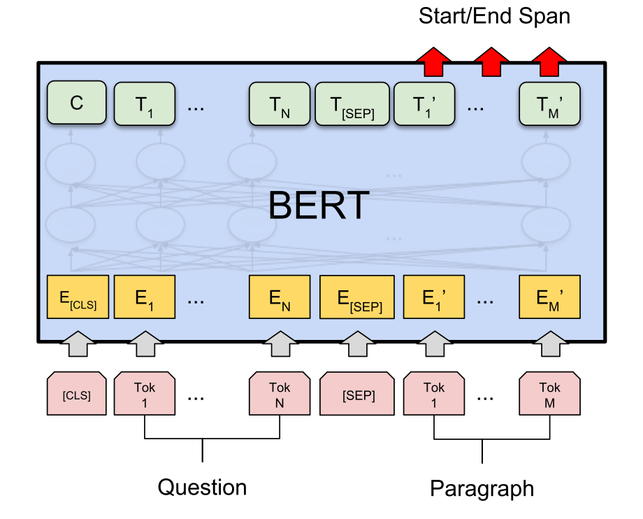

# NLP - Tool

### Last update : November 25, 2020

## About: 
This a all inclusive Natural Language Processing web-app which showcases various capabilities of NLP tools to extract useful insights from textual data.

It consists of following sub-modules:

 - Sentiment Analysis
 - Translation (Japanese - English)
 - Reverse Translation (English-Japanese)
 - Topic Modeller
 - Custom Topic Model

## Install :
Follow the below steps to setup the NLP - Tool:

 1. Clone the repository to your local machine
 2. The model files are not indexed in the repository and must be downloaded separately
 3. Use the [This Link](https://drive.google.com/file/d/1-7Emdf8as4QJ0VfYPgOg26leSNSIuEUj/view?usp=sharing) to download the zip file
 4. Extract the zip file in nlp-directory  (refer to "NLP-Tool/settings.py" for location info.)
 5. Install dependencies using  `pip install -r requirements.txt`
 6. Run the server using `python3 manage.py runserver`

# Modules:
## Sentiment Analysis
Sentiment Analysis is Machine Learning NLP methodology that predicts polarity of input text. We use a **TensorFlow Hub** layer to encode our document to 128-dimensional vector and  feed this to a fully connect Neural - Network which outputs Sentiment Score.

 - Input : English Text
 - Output : Polarity Score
### Architecture

-----
## Translation
We can do translation tasks using a **Neural Machine Transfer model with Attention**. There are two translation models built in the tool 

 - Japanese - English Translation
 - English - Japanese Translation
### Architecture

---
## Topic Modeller
Topic modeller module enables the user to extract to relevant topics from given input text using **Latent Dirichlet Allocation**.
Moreover it gives user the top related keywords relevant to topics extracted

 - Input : English Text
 - Output : List of topics with top keywords for every topic
### Architecture

---
## Custom Topic Model
This module enables us to extract custom Entities using **Named Entity Recognition** model, also this module classifies data in custom classes.

 - Input : English Text
 - Output : Class of the text, User defined Entities
### Architecture

---
## Question Answering
This module demonstrates Question Answering capabilities of a **BERT** model and how it can be leveraged to extract insights from given textual excerpts.
 
 - Inputs : English Text, Question Query
 - Output : Answer    

### Architecture

---
****

 

  
